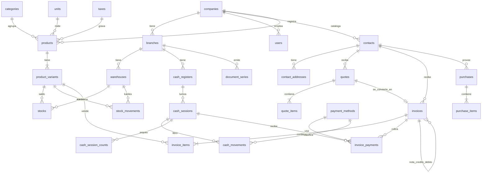

# Diagrama ER

```mermaid
erDiagram
    companies ||--o{ branches : tiene
    branches ||--o{ warehouses : tiene
    branches ||--o{ cash_registers : tiene
    branches ||--o{ document_series : emite
    companies ||--o{ users : emplea
    companies ||--o{ contacts : registra
    contacts ||--o{ contact_addresses : tiene
    companies ||--o{ products : cataloga
    categories ||--o{ products : agrupa
    units ||--o{ products : mide
    taxes ||--o{ products : grava
    products ||--|{ product_variants : tiene
    product_variants ||--o{ stocks : saldo
    warehouses ||--o{ stocks : almacena
    product_variants ||--o{ stock_movements : kardex
    warehouses ||--o{ stock_movements : kardex
    contacts ||--o{ quotes : recibe
    quotes ||--|{ quote_items : contiene
    quotes ||--o| invoices : se_convierte_en
    contacts ||--o{ invoices : recibe
    invoices ||--|{ invoice_items : contiene
    invoices ||--o{ invoice_payments : cobra
    invoices ||--o{ invoices : nota_credito_debito
    product_variants ||--o{ invoice_items : vende
    contacts ||--o{ purchases : provee
    purchases ||--|{ purchase_items : contiene
    payment_methods ||--o{ invoice_payments : usa
    cash_registers ||--o{ cash_sessions : turnos
    cash_sessions ||--o{ cash_movements : libro
    cash_sessions ||--o{ cash_session_counts : arqueo
    cash_sessions ||--o{ invoice_payments : recibe
    payment_methods ||--o{ cash_movements : clasifica
```
